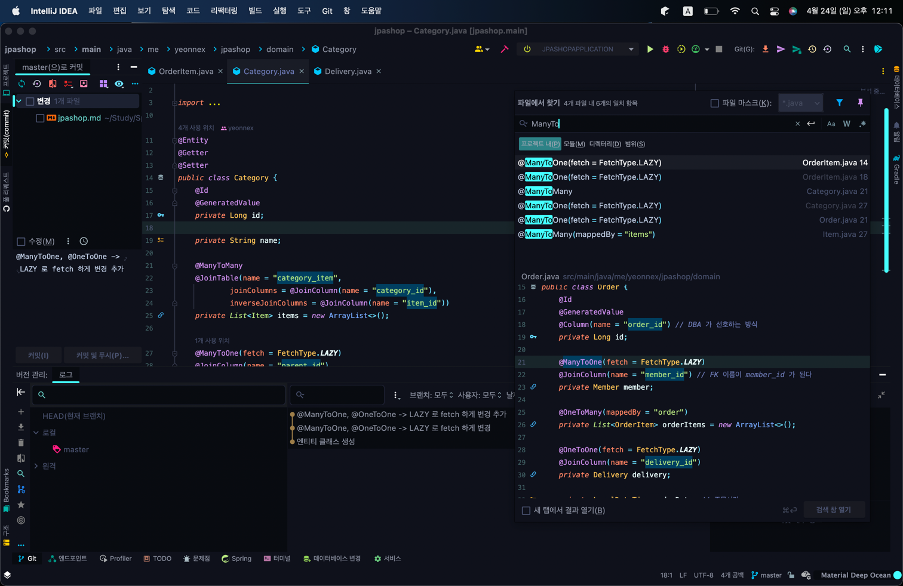

## [⚠️엔티티 설계시 주의점]
<hr/>

**1. 엔티티에는 가급적 setter 를 사용하지 말자**

**2. 모든 연관관계는 지연로딩으로 설정하자**

- 즉시 로딩(EAGER)은 예측이 어렵고, 어떤 SQL이 실행될지 추적하기 어렵다.

  - 특히 `JPQL`을 실행할 때 N+1 문제가 자주 발생한다
    - select o from order o; -> `실제 SQL 발생` select * from Order;
    - 기대한 쿼리는 Order 테이블에서 주문들을 가져오는 하나의 쿼리`(1)`였지만
    - Member 가 EAGER 로 설정되어있는 바람에 각 Order 의 Member 를 가져오는 쿼리도 수행됨`(N)`
    - 만약 Order 가 10000개 였다면, Order 를 가져오는 하나의 쿼리만 수행되는게 아니라,

      각 Order 의 Member 를 가져오는 10000개의  쿼리가 또 발생하는 것이다.
- **고로, 실무에서 모든 연관관계는 지연로딩(LAZY)으로 설정해야 한다.**
- 피치 못할 사정으로 연관된 엔티티를 함께 DB 에서 조회해야 한다면, fetch join 또는 엔티티 그래프를 사용한다
- @OneToOne, @ManyToOne 관계는 기본이 즉시로딩이므로, 직접 지연로딩으로 설정해주어야 한다.
- **즉 "XToOne" 시리즈들은 기본이 EAGER 이므로 재설정이 필요!**
- @OneToMany 의 기본값은 지연로딩이지만 명시하여 코딩하는 것이 좋다

**3. 컬렉션은 필드에서 초기화하자**

컬렉션은 필드에서 초기화하는 것이 안전하다.

- 일단 null 문제에서 안전

- 하이버네이트는 엔티티를 영속화할 때, 컬렉션을 감싸서 하이버네이트가 제공하는 PersistentBag 이라는 내장 컬렉션으로 변경한다. 

  - 만약 `getOrders()` 처럼 임의의 메서드에서 컬렉션을 잘못 생성하면 하이버네이트가 원하는 동작을 해줄수가 없다. 따라서 필드레벨에서 생성하는 것이 가장 안전하고 코드도 간결!

  - ```java
    Member member = new Member();
    System.out.println(member.getOrders().getClass()); // java.util.ArrayList
    
    em.persist(member); // 영속화!
    System.out.println(member.getOrders().getClass()); // org.hibernate.collection.internal.PersistentBag
    ```

    

## [엔티티 설계시 🍯팁]
<hr>

### @ManyToOne 이 쓰인 곳을 한번에 찾아 LAZY 로 바꾸고 싶다면!

>`command + f + shift` 로 @ManyToOne 이 쓰인 모든 곳을 찾아낼 수 있다.



### 엔티티를 영속화하기 위해, 각 엔티티 하나하나 em.persist 해주어야 하는 수고로움을 덜고 싶다면!
> cascade = CascadeType.ALL 옵션을 주자

```java
import me.yeonnex.jpashop.domain.Delivery;

import javax.persistence.CascadeType;
import javax.persistence.OneToMany;
import java.util.ArrayList;

public class Order {
  ...
  @OneToMany(mappedBy = "order", cascade = CascadeType.ALL)
  private List<OrderItem> orderItems = new ArrayList<>();

  @OneToOne(fetch = LAZY, cascade = CascadeType.ALL)
  private Delivery delivery;
}
```
이렇게 하면, Order 만 persist 해준다면 OrderItem 과 Delivery 가 덩달아 함께 persist 되게 한다.

## [회원 도메인 개발]
<br/>

구현 기능

- 회원 등록
- 회원 조회

순서

- 회원 엔티티코드 다시 보기
- 회원 리포지토리 개발
- 회원 서비스 개발
- 회원 기능 테스트

## [상품 도메인 개발]

구현 기능

- 상품 등록
- 상품 목록 조회
- 상품 수정

순서

- 상품 엔티티에 로직 넣기-> 응집성⬆️)
  - 재고 추가 로직
  - 재고 감소 로직
- 상품 리포지토리 개발
- 상품 서비스 개발
- 상품 기능 테스트

